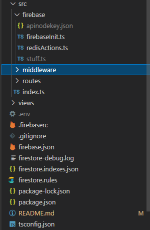

# HELLO
### this is a nodejs-express-typescript project which you can use an a starting point by cloning or follow the steps i used to set it up below

  ```mmkdir mkdir node-express-typescript ```<br/>
```cd node-express-typescript/```<br/>
```npm init --yes```<br/>

### then we install some packages

  ``` npm install express dotenv ```<br/>
 ``` npm i -D typescript @types/express @types/node ```<br/>
 ``` npm install -D concurrently nodemon```<br/>


then run 
```npx tsc --init ```<br/>
to configure typescript

don't forget to add the outdir option
```{
  "compilerOptions": {
    "outDir": "./dist"

    // rest options remain same
  }
}
```
<br/>

and the scripts
```
{
  "scripts": {
    "build": "npx tsc",
    "start": "node dist/index.js",
    "dev": "concurrently \"npx tsc --watch\" \"nodemon -q dist/index.js\""
  }
}
```
<br/>

## to start the server run:

```
npm run watch
npm start 
```

# THE GOOGLE API PART

### building on the basic template i implememted  a simple server that lets authenticates your google account and grants you a refresh and access token to manipulate apis like google docs , gmail, google sheets , google maps ...

<br/>

> ## important terminology

| Term | meaning |
| ---------------- | ---------------- |
| **access token**     |  short lived (1 hr) token ,needed to authenticate you in the api  |
| **refresh token**    | longer livedsed to refresh the access token when it expires
| **client id** | you'll find tis in the GCP console|
| **client secret** | you'll find it in the GCP console |
|**redirect url**| a route that the authentication response will be sent to , these credentials can then be exchanged for tokens|

#### To get started ypu'll need to go set up a project in GCP

[article explanation](https://dev.to/tigawanna/my-experience-with-google-apis-and-oauth2-4786)

after this you'll have

- client secret
- client id
- redirect url : in mycase i used "http://localhost:3000/oauth2callback"

  > a server will spawn and get te token from that route then get destroyed so make sure nothing
  >  else is running on that route. my main server runs on "http://localhost:4000" 

My .env file would look something like this

```
CLIENT_ID="66568-7747=623-this-is-client-id"
CLIENT_SECRET ="HGSTRFSygugsoL-ths-is-client-secret "
REDIRECT_URL="http://localhost:3000/oauth2callback"
MY_EMAIL="email@gmail.com"
```

I use firebase to persist the tokens , if you want to implement that you'll need to download your project's  service key which is in json format and add it into the firebase directory 
!!!! Remember to gitignore this and te .env file !!!

### My file structire looks like this:
<br/>



## Quick overview of the flow

----
when you hit a route ,<br/>
the middleware **initChecks** intercepts the request and 
uses the email provided as the key to check for an refresh token in redis , if none is found it checks firebase , if nono is found it initiates an new authentication request and gets tokens.
which are then used to authenticate a google oauth2client and injects them into the request.query to be used in the respective routes

> You can ignore the extra firebase stuff which are a      > result of adding firebase emulator for local testing

[Article on firebase emulator setup](https://dev.to/tigawanna/firebase-emulator-16l2)

```
import apikey  from './apinodekey.json';
var admin = require("firebase-admin");


const dbUrl = process.env.DBURL
const initFirebase=async()=>{
  try{
    process.env['FIRESTORE_EMULATOR_HOST'] = 'localhost:8080';
    await admin.initializeApp({
      credential: admin.credential.cert(apikey),
       databaseURL:dbUrl
     });
  }catch(err){
   console.log("error initialozing firebase === ",err)
  }
}


export{initFirebase}
```

Remember to omit from the above code
```
    process.env['FIRESTORE_EMULATOR_HOST'] = 'localhost:8080';
 ```

 if you're not going to use the emulator  

[googleapis nodejs client official docs](https://github.com/googleapis/google-api-nodejs-client)
